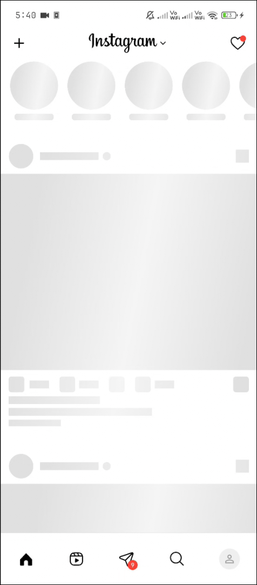
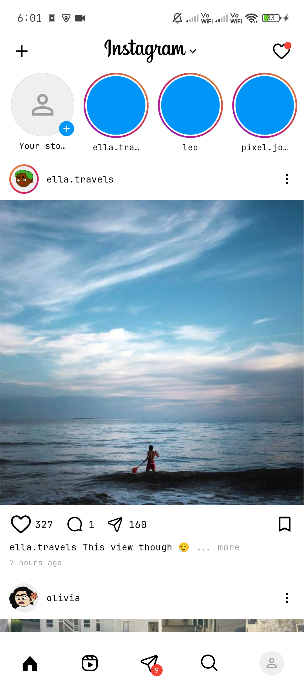
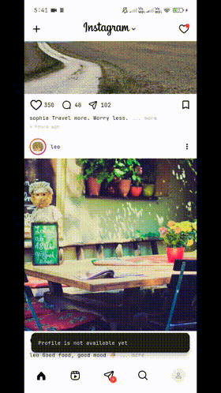

# Instagram Feed UI — Flutter Assignment

A replication of the Instagram Home Feed built with Flutter,
submitted as part of the ZREX Flutter Developer Internship Assignment.

## Screenshots

<p align="center">
  
  
</p>

## Demo

<p align="center">
  
  
  
</p>

<p align="center">
  
  
  
</p>

## Features
- Instagram-style Home Feed with Stories tray and Post feed
- Shimmer loading states for both stories and posts
- Infinite scroll pagination with lazy loading
- Carousel posts with synchronized dot indicator and swipe counter
- Pinch-to-Zoom image overlay with snap-back animation
- Double tap to like with heart animation overlay
- Like and Save stateful toggles
- Custom Snackbar for unimplemented actions
- Error state handling with broken image fallback

## State Management — BLoC
BLoC (Business Logic Component) was chosen for the following reasons:
- **Separation of concerns** — UI, business logic, and data are strictly separated
- **Predictable state** — every UI change is driven by an explicit event and state
- **Scalability** — adding new features (e.g. comments, reels) only requires new events/states


## Architecture
```
lib/
├── core/
│   ├── config/        # AppTheme
│   └── const/         # AppIcons
├── logic/
│   ├── bloc/          # FeedBloc, FeedEvent, FeedState
│   ├── model/         # Post
│   └── repository/    # PostRepository
├── ui/
│   ├── screen/        # FeedScreen
│   ├── view/          # FeedScrollView
│   └── widget/        # All UI widgets
└── main.dart
```

## Packages Used

| Package | Purpose |
|---|---|
| `flutter_bloc` | State management |
| `cached_network_image` | Network image caching |
| `shimmer` | Shimmer loading effects |
| `like_button` | Like animation |
| `pinch_scrollable` | Pinch-to-zoom in scroll views |
| `flutter_svg` | SVG icon rendering |

## Run Instructions

1. Clone the repository
```bash
   git clone https://github.com/abhijeetsagr-g/zrek_assignment.git
   cd zrek_assignment
```

2. Install dependencies
```bash
   flutter pub get
```

3. Run the app
```bash
   flutter run
```